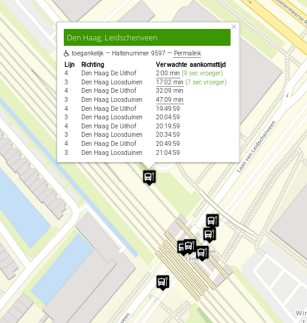

# MMM-NLDepartureTimes

## Update 2024
I don´t have a MM at the moment. And I live in area with barely public transportation. I have deceided to archive this project.

## Introduction
This module shows the departure times of public transport grouped by stops and destination of choiche. In this example you see the stops De Lanen and Leidschenveen. Leidschenveen is a LightRail hub that services lines 3,4, E, 19, 30, and N5. The lines interested are grouped to their destination, instead on line number. This way you can quickly see when a vehicle departes to your real destination fo travel.


In the screenshot above I have two stops; Leidschenveen and De Lanen for streetcar 19. The destination is here set to what I tink is relevant for me. For instance, line 3 goes to Den Haag Loosduinen and E goes the Den Haag Centraal. In this example it is relevant for me that they go to Den Haag. So, I grouped them in destination Den Haag. Line 19 is grouped in destination Leidschendam. In this example I only intersted in direction Leidschendam and the other destination Delft is left out this way.

The data used by this module is from [OVapi](https://www.ovapi.nl). OVApi is a semi private project that allows usage by others.

**Note:** This Module only works with Dutch Public transportation.

## Installation
Clone the repository with

    git clone https://github.com/Travelbacon/MMM-NLDepartureTimes

This module depends on [Axios](https://github.com/axios/axios). You can install it by going to the module folder and execute:

    npm install

## Configuration
To use this module, add the follwing configuration to your `config/config.js` file. This is an example for a lightrail station in The Hague, and will be used throughout this readme.md.
```javascript
  modules: [
  {
    module: "MMM-NLDepartureTimes",
    position: "top_left",
    header: "Departure Times",
    config: {
      maxVehics: 5,
      updateSpeed: 10,
      locale: 'nl-NL',
      tpc: {
        'Leidschenveen':{
          'Den Haag': [31008721, 32009597],
          'Zoetermeer': [32009596],
          'Rotterdam': [31008722]
        },
        'De Lanen':{
          'Leidschendam': [32009591]
        }
      }
    }
}]
```

| Option | Description
|----------|-------------
|`module`   | Module Name. (See [MM Documentation](https://docs.magicmirror.builders/modules/configuration.html))
|`position` | Postion of the module. (See [MM Documentation](https://docs.magicmirror.builders/modules/configuration.html))
|`header`   | Title displayed. (See [MM Documentation](https://docs.magicmirror.builders/modules/configuration.html))
|`maxVehics` | Number of departure times displayed per destinaton.<br>**Type:** Integer **Default:** 5
|`updateSpeed` | refresh time in minutes. Please keep a slow refresh due non commercial property of the API server. See [Github](https://github.com/skywave/KV78Turbo-OVAPI/wiki) of OVapi for etiquette.<br>**Type:** Integer  **Default:** 10
|`tpc` | See configure stops below.<br>**Type:** Javascript Object.

## Configure stops
### The TPC Object in config.
The tpc parameter in the settings is a Javascript Object. 

#### Objet design:

| Level | Description | Explanation
|-------|-------|------
|Top  | Name of the group of stops.| Name of choice of your hub. **Type:** String.
|2nd  | Name of the destination | Array that contains the actual TPC (stopcodes) **Type:** Integer

TPC is a code that identifies a stop. To get the right TPC, it will require some research. Until now I haven't found one document that contains all the data needed. If you know a quicker soluiton, please let me know!

#### Find the TPC code

**tldr;**

The TPC is in the xml file called PassengerStopAssignmentCHB{timestamp}.xml from [NDOV Loket's haltes folder](http://data.ndovloket.nl/haltes/).
Convert the stopname to userstopcode at [OV Zoeker](https://ovzoeker.nl/) or [KV1](http://data.ndovloket.nl/). Convert userstopcode to TPC via the XMLs from [halte export](http://data.ndovloket.nl/haltes).

**Detailed steps**

First you need to find a location where you want to get the departure times from. In this example I picked two stops. The stops of RandstadRail 3 & 4 to The Hague and to Zoetermeer together with metro line E to The Hague and Rotterdam. I will call this stop Leidschenveen. In real it has 3 different names. From a tram stop further away line 19 to Leidschendam is needed. The direction to Delft is not needed. This stop will be called De Lanen.

You can find your own stops at [OV Zoeker](https://ovzoeker.nl/) and also the operator.

To sum up the data needed.

| Stopname | Line | Operator | Destination | Real Destination
|---------------|---|-----|-----------|-------
| Leidschenveen | 3 | HTM | Den Haag | Den Haag Loosduinen
| Leidschenveen | 4 | HTM | Den Haag | Den Haag Uithof
| Leidschenveen | 3 | HTM | Zoetermeer | Zoetermer Centrum West
| Leidschenveen | 4 | HTM | Zoetermeer | Lansingerland Zoetermeer
| Leidschenveen | E | RET | Den Haag | Den Haag Centraal
| Leidschenveen | E | RET | Rotterdam | Slinge
| De Lanen | 19 | HTM | Leidschendam | Leidschendam

Now the stopnames can be converted to userstopcodes. From [OV Zoeker](https://ovzoeker.nl/) you can find them by clicking on a stop and select the code behind 'Haltenummer'.



A more complex way is via a [KV1](http://data.ndovloket.nl/). The KV1 archive is in the folder of the operator at [data.ndovloketnl](http://data.ndovloket.nl/). In this KV1 archive you need the file USERSTOPXXX.TMI. This is plain text holding all data about a stop. For line 3 and 4 the userstopcode is `9597`.

`[RecordType]|[Version number]|[Implicit/Explicit]|[DataOwnerCode]|[UserStopCode]|[TimingPointCode]|[GetIn]|[GetOut]|[Deprecated]|[Name]|[Town]|[UserStopAreaCode]|[StopSideCode]|[RoadSideEqDataOwnerCode]|[RoadSideEqUnitNumber]|[MinimalStopTime]|[StopSideLength]|[Description]|[UserStopType]`

`USRSTOP|1|I|HTM|9597||TRUE|TRUE|N|Leidschenveen|Den Haag|9596|-|||0||exitDirection=No side;EnableTailTrack=F;SizeOfBay=43;BayBeforePole=38;garage=F|PASSENGER`

Next step is to get the TPC. From [halte export](http://data.ndovloket.nl/haltes) we can retrieve the PassengerStopAssignmentCHB{timestamp}.xml file and ExportCHB for the trains of NS. Open the XML file and search for the userstopcode. In this example the the following node gives a hit for userstopcode 9597.
```XML
  <quay>
    <quaycode>NL:Q:32009597</quaycode>
    <userstopcodes>
      <userstopcodedata>
        <dataownercode>HTM</dataownercode>
        <userstopcode>9597</userstopcode>
        <validfrom>2014-12-14 00:00:00</validfrom>
      </userstopcodedata>
    </userstopcodes>
  </quay>
```
The ```XML <quaycode>``` contains the TPC code. In this case 32009597.

By going to [https://v0.ovapi.nl/tpc/32009597](http://v0.ovapi.nl/tpc/32009597) you can test if the TPC is correct. When an XML file is generated with stop data and time information, we have the right TPC code.

The final table will be:

| Stopname | Line | Operator | Destination | stopcode | TPC
|---------------|---|-----|-----------|-------|----
| Leidschenveen | 3 | HTM | Den Haag   | 9597 | 32009597
| Leidschenveen | 4 | HTM | Den Haag   | 9597 | 32009597
| Leidschenveen | 3 | HTM | Zoetermeer | 9596 | 32009596
| Leidschenveen | 4 | HTM | Zoetermeer | 9596 | 32009596
| Leidschenveen | E | RET | Den Haag   | HA8721 | 31008722
| Leidschenveen | E | RET | Rotterdam  | HA8722 | 31008721
| De Lanen | 19 | HTM | Leidschendam   | 9591 | 32009591

This compresses to

| Stopname | Destination | TPC
|--|--|--
| Leidschenveen | Den Haag | 3200597, 31008722
| Leidschenveen | Zoetermeer| 3200596
| Leidschenveen | Rotterdam | 31008721
| De Lanen | Leidschendam | 32008581

## Licenses
Data from [OVApi](http://www.ovapi.nl) comes from [NDOV Loket](https://ndovloket.nl). The usage is limited to 1 producion system and 1 user. So does the use of this module.
Because data is not from my sources, nor from OVApi, I and OVApi are not responsible for data loss, damage or (in)consistency of data.
For more details please see their websites.
## Privacy Satement
On [OVApi](http://www.ovapi.nl/privacy.html) there is a privacy statement in Dutch. If you require a non-Dutch version, please contact them directly.
I have no responsibly of what happens to your data. Nor do I store any data from you.
